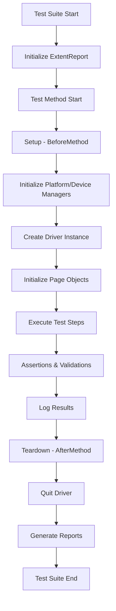

# TNY iOS Automation - Technical Documentation

## Table of Contents
1. [Architecture Overview](#architecture-overview)
2. [Design Patterns](#design-patterns)
3. [Framework Components](#framework-components)
4. [Driver Management](#driver-management)
5. [Page Object Model Implementation](#page-object-model-implementation)
6. [Test Execution Flow](#test-execution-flow)
7. [Reporting Mechanism](#reporting-mechanism)
8. [Configuration Management](#configuration-management)
9. [Error Handling](#error-handling)
10. [Performance Considerations](#performance-considerations)

## Architecture Overview

### High-Level Architecture
The TNY iOS Automation framework follows a layered architecture pattern with clear separation of concerns:

```
┌─────────────────────────────────────────────────────────────┐
│                    Test Layer                               │
│  ┌─────────────────┐  ┌─────────────────┐  ┌──────────────┐ │
│  │ FTUE Tests      │  │ Library Tests   │  │ PlayTab Tests│ │
│  └─────────────────┘  └─────────────────┘  └──────────────┘ │
└─────────────────────────────────────────────────────────────┘
┌─────────────────────────────────────────────────────────────┐
│                   Page Object Layer                        │
│  ┌─────────────────┐  ┌─────────────────┐  ┌──────────────┐ │
│  │ FTUE Page       │  │ Library Page    │  │ PlayTab Page │ │
│  └─────────────────┘  └─────────────────┘  └──────────────┘ │
└─────────────────────────────────────────────────────────────┘
┌─────────────────────────────────────────────────────────────┐
│                  Action Layer                               │
│  ┌─────────────────────────────────────────────────────────┐ │
│  │              ScreenActions                              │ │
│  └─────────────────────────────────────────────────────────┘ │
└─────────────────────────────────────────────────────────────┘
┌─────────────────────────────────────────────────────────────┐
│                  Driver Layer                               │
│  ┌──────────────┐  ┌──────────────┐  ┌───────────────────┐  │
│  │DriverManager │  │DriverFactory │  │ Platform Managers │  │
│  └──────────────┘  └──────────────┘  └───────────────────┘  │
└─────────────────────────────────────────────────────────────┘
┌─────────────────────────────────────────────────────────────┐
│                Infrastructure Layer                         │
│  ┌──────────────┐  ┌──────────────┐  ┌───────────────────┐  │
│  │ LambdaTest   │  │ Appium       │  │ iOS Simulator     │  │
│  └──────────────┘  └──────────────┘  └───────────────────┘  │
└─────────────────────────────────────────────────────────────┘
```

### Technology Stack Details

| Component | Technology | Version | Purpose |
|-----------|------------|---------|---------|
| Build Tool | Maven | 3.6+ | Dependency management and build automation |
| Programming Language | Java | 11 | Core development language |
| Mobile Automation | Appium | 7.4.1 | Mobile application automation |
| Test Framework | TestNG | 7.6.0 | Test execution and management |
| WebDriver | Selenium | 3.141.59 | Browser automation support |
| Reporting | ExtentReports | 5.0.9 | Enhanced test reporting |
| Cloud Platform | LambdaTest | - | Cloud-based device testing |

## Design Patterns

### 1. Singleton Pattern
**Implementation**: DriverManager, ExtentReportManager
**Purpose**: Ensures single instance of critical components

```java
public final class DriverManager {
    private static final ThreadLocal<AppiumDriver<MobileElement>> threadLocalDriver = 
        new ThreadLocal<AppiumDriver<MobileElement>>();
    
    public static AppiumDriver<MobileElement> getDriver() {
        return threadLocalDriver.get();
    }
}
```

### 2. Factory Pattern
**Implementation**: DriverFactory
**Purpose**: Creates driver instances based on platform

```java
public static void initializedriver(MobilePlatformName mobilePlatformName, 
                                  String deviceName, String platformVersion, 
                                  String emulator, String app, String appname) {
    AppiumDriver<MobileElement> driver;
    switch (mobilePlatformName) {
        case iOS:
            driver = Drivers.createiOSDriverForNativeApp(deviceName, platformVersion, 
                                                       emulator, app, appname);
            break;
        default:
            throw new Exception("Platform name " + mobilePlatformName + " is not found");
    }
    DriverManager.setAppiumDriver(driver);
}
```

### 3. Page Object Model (POM)
**Implementation**: All page classes extend ScreenActions
**Purpose**: Encapsulates page elements and actions

```java
public final class FTUEscreenvalidation extends ScreenActions {
    @iOSXCUITFindBy(xpath="//XCUIElementTypeStaticText[@name=\"Skip\"]")
    public MobileElement ftujskip;
    
    @iOSXCUITFindBy(accessibility="Amargo_Sign_in")
    public MobileElement ftujcenterimage;
}
```

### 4. ThreadLocal Pattern
**Implementation**: All Manager classes
**Purpose**: Thread-safe execution for parallel testing

```java
private static final ThreadLocal<String> deviceName = new ThreadLocal<>();
private static final ThreadLocal<String> platformName = new ThreadLocal<>();
```

## Framework Components

### 1. Driver Management System

#### DriverManager
- **Responsibility**: Thread-safe driver instance management
- **Key Methods**:
  - `getDriver()`: Returns current thread's driver instance
  - `setAppiumDriver()`: Sets driver for current thread
  - `unload()`: Removes driver from current thread

#### DriverFactory
- **Responsibility**: Driver creation and initialization
- **Key Methods**:
  - `initializedriver()`: Creates platform-specific driver
  - `quitDriver()`: Safely terminates driver session

#### Platform Managers
- **DeviceManager**: Manages device information per thread
- **PlatformManager**: Manages platform information per thread

### 2. Page Object Implementation

#### Base ScreenActions Class
```java
public class ScreenActions {
    protected ScreenActions() {
        PageFactory.initElements(new AppiumFieldDecorator(DriverManager.getDriver()), this);
    }
    
    // Common actions available to all page objects
    public static void click(MobileElement element, String elementName)
    public static void handleacceptAlert()
    public static void scrollVertical()
    public static void swipeRight()
}
```

#### Element Locator Strategy
- **Primary**: `@iOSXCUITFindBy` annotations
- **Fallback**: XPath expressions
- **Accessibility**: Accessibility identifiers when available

### 3. Test Execution Framework

#### Base Test Class
```java
public class Baseclass {
    @Parameters({"platformName", "platformVersion", "deviceName", "emulator", "app", "name"})
    @BeforeMethod
    protected void setup(String platformName, String platformVersion, String deviceName, 
                        String emulator, String app, String appname) throws Exception {
        // Initialize platform and device managers
        // Create driver instance if not exists
    }
    
    @AfterMethod
    protected void tearDown(ITestResult result) {
        // Quit driver and cleanup
    }
}
```

## Driver Management

### LambdaTest Integration
```java
public static AppiumDriver<MobileElement> createiOSDriverForNativeApp(
    String deviceName, String platformVersion, String emulator, String app, String appname) {
    
    String userName = System.getenv("LT_USERNAME") == null ? "default_username" 
                    : System.getenv("LT_USERNAME");
    String accessKey = System.getenv("LT_ACCESS_KEY") == null ? "default_key" 
                     : System.getenv("LT_ACCESS_KEY");
    
    DesiredCapabilities capabilities = new DesiredCapabilities();
    capabilities.setCapability(MobileCapabilityType.DEVICE_NAME, deviceName);
    capabilities.setCapability(MobileCapabilityType.VERSION, platformVersion);
    capabilities.setCapability(CapabilityType.PLATFORM_NAME, Platform.IOS);
    capabilities.setCapability("isRealMobile", true);
    capabilities.setCapability(MobileCapabilityType.APP, app);
    capabilities.setCapability("deviceOrientation", "PORTRAIT");
    capabilities.setCapability("autoGrantPermissions", true);
    capabilities.setCapability("build", "IdentiySigninTest");
    capabilities.setCapability("name", appname);
    
    return new AppiumDriver<MobileElement>(
        new URL("https://" + userName + ":" + accessKey + "@mobile-hub.lambdatest.com/wd/hub"), 
        capabilities);
}
```

### Capability Configuration
| Capability | Value | Purpose |
|------------|-------|---------|
| deviceName | iPhone 15 Pro | Target device specification |
| platformVersion | 17.x | iOS version |
| isRealMobile | true | Use real device vs simulator |
| deviceOrientation | PORTRAIT | Screen orientation |
| autoGrantPermissions | true | Auto-accept app permissions |
| console | true | Enable console logs |
| network | false | Disable network logs |
| visual | true | Enable visual logs |
| devicelog | true | Enable device logs |

## Page Object Model Implementation

### Element Declaration Pattern
```java
@iOSXCUITFindBy(xpath="//XCUIElementTypeButton[@name=\"Sign in\"]")
public MobileElement ftujsigninbutton;

@iOSXCUITFindBy(accessibility="Amargo_Sign_in")
public MobileElement ftujcenterimage;
```

### Action Implementation Pattern
```java
public static void click(MobileElement element, String elementName) {
    try {
        element.click();
        ExtentReportLogger.logInfo("Clicked on " + elementName);
    } catch (Exception e) {
        ExtentReportLogger.logFail("Exception occurred when clicking on - " + elementName, e);
    }
}
```

### Scroll and Swipe Implementation
```java
public static void scrollVertical() {
    Dimension size = DriverManager.getDriver().manage().window().getSize();
    int startX = size.getWidth() / 2;
    int startY = (int) (size.getHeight() * 0.8);
    int endX = startX;
    int endY = (int) (size.getHeight() * 0.2);
    
    PointerInput finger1 = new PointerInput(PointerInput.Kind.TOUCH, "finger1");
    Sequence sequence = new Sequence(finger1, 1)
        .addAction(finger1.createPointerMove(Duration.ZERO, PointerInput.Origin.viewport(), startX, startY))
        .addAction(finger1.createPointerDown(PointerInput.MouseButton.LEFT.asArg()))
        .addAction(new Pause(finger1, Duration.ofMillis(200)))
        .addAction(finger1.createPointerMove(Duration.ofMillis(100), PointerInput.Origin.viewport(), endX, endY))
        .addAction(finger1.createPointerUp(PointerInput.MouseButton.LEFT.asArg()));
    
    DriverManager.getDriver().perform(Collections.singletonList(sequence));
}
```

## Test Execution Flow

### Test Lifecycle


### Parameter Injection Flow
1. **TestNG XML Configuration**: Defines test parameters
2. **@Parameters Annotation**: Injects parameters into test methods
3. **Manager Classes**: Store parameters in ThreadLocal variables
4. **Driver Creation**: Uses parameters for capability configuration

### Test Method Structure
```java
@FrameworkAnnotation(author = "Nidhishri", category = {CategoryType.REGRESSION, CategoryType.SMOKE})
@Test
public void ftuescreensigninflow() throws InterruptedException {
    // Wait for app initialization
    Thread.sleep(20000);

    // Validate UI elements
    Assert.assertTrue(ftuescreevalidation.ftujsigninbutton.isDisplayed());

    // Perform actions
    ScreenActions.click(ftuescreevalidation.ftujsigninbutton, "FTUE sign in Button");

    // Handle system alerts
    ScreenActions.handleacceptAlert();

    // Continue test flow...
}
```

## Reporting Mechanism

### ExtentReports Integration

#### Report Manager Architecture
```java
public final class ExtentReportManager {
    private static final ExtentSparkReporter extentSparkReporter =
        new ExtentSparkReporter(Frameworkcontants.getExtentReportPath());
    private static final ThreadLocal<ExtentTest> threadLocalExtentTest = new ThreadLocal<>();
    private static ExtentReports extentReports;

    public static void initExtentReport() {
        extentReports = new ExtentReports();
        extentReports.attachReporter(extentSparkReporter);
        extentReports.setSystemInfo("Host Name", hostname);
        extentReports.setSystemInfo("Environment", "TNY iOS Mobile Automation - Appium");
        extentReports.setSystemInfo("User Name", System.getProperty("user.name"));
        extentSparkReporter.config().setTheme(Theme.DARK);
    }
}
```

#### Report Logger Implementation
```java
public final class ExtentReportLogger {
    public static void logInfo(String message) {
        ExtentReportManager.getExtentTest().info(message);
    }

    public static void logPass(String message) {
        ExtentReportManager.getExtentTest().pass(message);
    }

    public static void logFail(String message, Throwable throwable) {
        ExtentReportManager.getExtentTest().fail(message, throwable);
    }
}
```

#### TestNG Listener Integration
```java
public class Listeners implements ITestListener, ISuiteListener {
    @Override
    public void onStart(ISuite suite) {
        ExtentReportManager.initExtentReport();
    }

    @Override
    public void onTestStart(ITestResult result) {
        ExtentReportManager.createTest(result.getMethod().getMethodName());
        ExtentReportManager.addAuthors(
            result.getMethod().getConstructorOrMethod().getMethod()
                .getAnnotation(FrameworkAnnotation.class).author());
        ExtentReportManager.addCategories(
            result.getMethod().getConstructorOrMethod().getMethod()
                .getAnnotation(FrameworkAnnotation.class).category());
    }
}
```

### Report Features
- **Multi-threaded Support**: Thread-safe report generation
- **Rich Metadata**: Author, category, device information
- **System Information**: Host, environment, user details
- **Test Categorization**: Smoke, regression, sanity tests
- **Timestamped Reports**: Unique report generation per execution

## Configuration Management

### Framework Constants
```java
public final class Frameworkcontants {
    public static final String PROJECT_PATH = System.getProperty("user.dir");
    public static final String iOS_APP_PATH = "/Users/nbasavalingaiah/Library/Developer/Xcode/DerivedData/DailyNewYorker-azuytexbknysjyetvkrdmjamttge/Build/Products/Release-iphonesimulator/DailyNewYorker.app";
    private static final String EXTENT_REPORT_PATH = PROJECT_PATH + File.separator + "extent-test-report";

    public static String getExtentReportPath() {
        return EXTENT_REPORT_PATH + File.separator + getCurrentDateTime() + File.separator + "index.html";
    }

    private static String getCurrentDateTime() {
        DateTimeFormatter dateTimeFormatter = DateTimeFormatter.ofPattern("yyyy_MM_dd-HH_mm_ss");
        LocalDateTime localDateTime = LocalDateTime.now();
        return dateTimeFormatter.format(localDateTime);
    }
}
```

### Environment Configuration
- **LT_USERNAME**: LambdaTest username (environment variable)
- **LT_ACCESS_KEY**: LambdaTest access key (environment variable)
- **Default Fallbacks**: Hardcoded values for development

### TestNG XML Configuration
```xml
<suite name="Suite">
    <listeners>
        <listener class-name="com.automate.listeners.Listeners"/>
    </listeners>
    <test name="TNY_Automation">
        <parameter name="emulator" value="yes"/>
        <parameter name="platformName" value="iOS"/>
        <parameter name="platformVersion" value="17"/>
        <parameter name="deviceName" value="iPhone 15 Pro"/>
        <parameter name="app" value="lt://APP101606121746871191016473"/>
        <parameter name="name" value="TheNewyorker"/>
        <classes>
            <class name="com.Tests.MyLibraryScreenvalidation_Tests"/>
        </classes>
    </test>
</suite>
```

## Error Handling

### Exception Handling Strategy
1. **Driver Level**: Graceful driver creation failure handling
2. **Element Level**: Element not found exception handling
3. **Action Level**: Action failure with detailed logging
4. **Test Level**: Test failure with screenshot capture

### Alert Handling
```java
public static void handleacceptAlert() {
    try {
        Alert alert = DriverManager.getDriver().switchTo().alert();
        if (alert != null) {
            System.out.println("Alert Found: " + alert.getText());
            alert.accept();
        }
    } catch (NoAlertPresentException e) {
        System.out.println("No alert present.");
    }
}
```

### Robust Element Interaction
```java
public static void click(MobileElement element, String elementName) {
    try {
        element.click();
        ExtentReportLogger.logInfo("Clicked on " + elementName);
    } catch (Exception e) {
        ExtentReportLogger.logFail("Exception occurred when clicking on - " + elementName, e);
        throw e; // Re-throw to fail the test
    }
}
```

## Performance Considerations

### Thread Safety
- **ThreadLocal Pattern**: Used throughout for parallel execution
- **Singleton Management**: Thread-safe singleton implementations
- **Resource Cleanup**: Proper cleanup in teardown methods

### Memory Management
- **Driver Cleanup**: Explicit driver quit in teardown
- **ThreadLocal Cleanup**: Remove ThreadLocal variables after use
- **Report Flushing**: Proper report resource management

### Execution Optimization
- **Smart Waits**: Implicit and explicit wait strategies
- **Element Caching**: Page factory pattern for element initialization
- **Parallel Execution**: TestNG parallel execution support

### Best Practices Implemented
1. **Fail-Fast Approach**: Early failure detection and reporting
2. **Resource Management**: Proper cleanup of drivers and reports
3. **Logging Strategy**: Comprehensive logging at all levels
4. **Modular Design**: Clear separation of concerns
5. **Extensibility**: Easy addition of new platforms and tests

## Security Considerations

### Credential Management
- Environment variables for sensitive data
- No hardcoded credentials in source code
- Secure LambdaTest integration

### Data Protection
- No sensitive test data in logs
- Secure handling of authentication flows
- Protected configuration files

## Maintenance and Extensibility

### Adding New Tests
1. Create new test class extending `Baseclass`
2. Add `@FrameworkAnnotation` with metadata
3. Implement test methods with proper assertions
4. Update TestNG XML configuration

### Adding New Page Objects
1. Create page class extending `ScreenActions`
2. Define elements using `@iOSXCUITFindBy`
3. Implement page-specific actions
4. Initialize in test setup

### Platform Extension
1. Add new enum value in `MobilePlatformName`
2. Implement platform-specific driver creation
3. Update `DriverFactory` switch statement
4. Add platform-specific capabilities

This technical documentation provides comprehensive coverage of the TNY iOS Automation framework's architecture, implementation details, and best practices for maintenance and extension.
```
